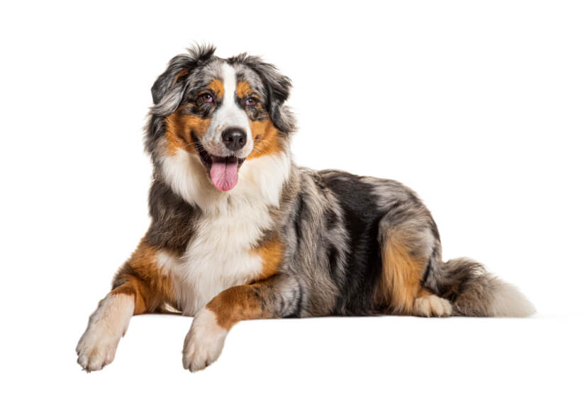
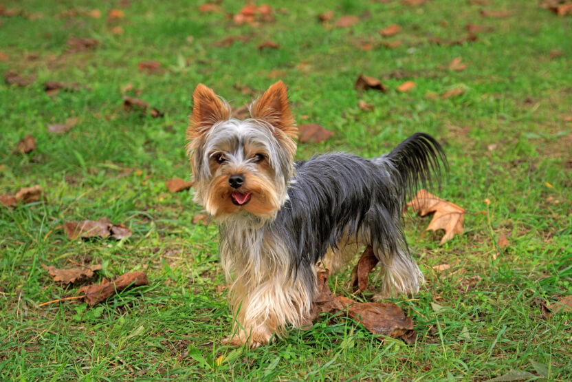
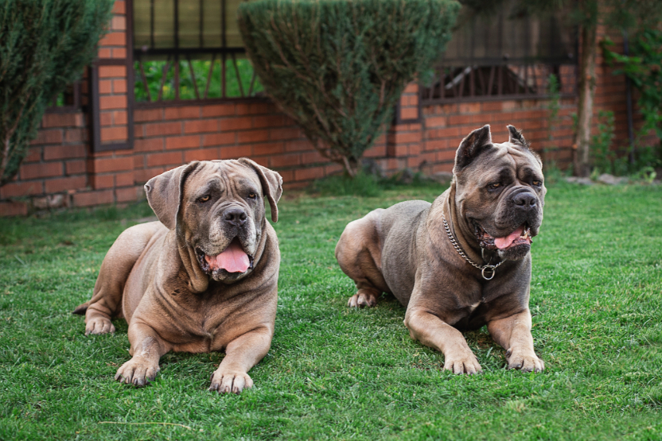

<!-- first slide - just a tittle - h1 -->

# Different Dog Breeds

---

<!-- image positioning with  md image syntaxt to try it out - this one has label if it doesn't render the image correctly and setting it to basic split background positioned to the right with split size 60% -->

<!-- adding a class that will work on this slide and the next ones - this class is used to style the header to have text-align: center property-->
<!-- class: centered -->

## Australian Shepherd

<!-- this is h2 -->

---

<!-- new slide -->

## Bulldogs

<!-- h2 -->

<!-- to use flex layout
- creating a wrapper div with class flexed and divs inside (initially these were just images but then added the labels (
) so had to wrap them in div to have nicer layout)
- then having an image tag  (now realised that all of the images need alt attribute for accesibility)
 -->

    

    
    
English

    

    

    
    
French

    

---

<!-- _class: side -->
<!-- this class is local in marp and is only gonna be applied to this slide, this is to align the text on the left
- here usng html to align the image on the left also using flex
-->

  
  

    <h2>Yorkshire Terrier</h2>
    
Yorkies, are small dogs with big attitudes. Despite their small size, Yorkies are brave and confident, often acting as little watchdogs to their owners.

  

---

## More of the dogs

<!-- h2 -->

<!-- here aligning the images with grid, so wrapping everything in div as a parent container with class grid, then using figure as a wrapper of the iage and the caption for it -->

    <figure>
        
        <figcaption class="caption">Beagle</figcaption>
    </figure>
    <figure>
        
        <figcaption class="caption">Boxer</figcaption>
    </figure>
    <figure>
        
        <figcaption class="caption">Cane Corso</figcaption>
    </figure>
    <figure>
        
        <figcaption class="caption">Cavalier Spaniel</figcaption>
    </figure>
    <figure>
        
        <figcaption class="caption">Dachshund</figcaption>
    </figure>
    <figure>
        
        <figcaption class="caption">Miniature Schnauzer</figcaption>
    </figure>

